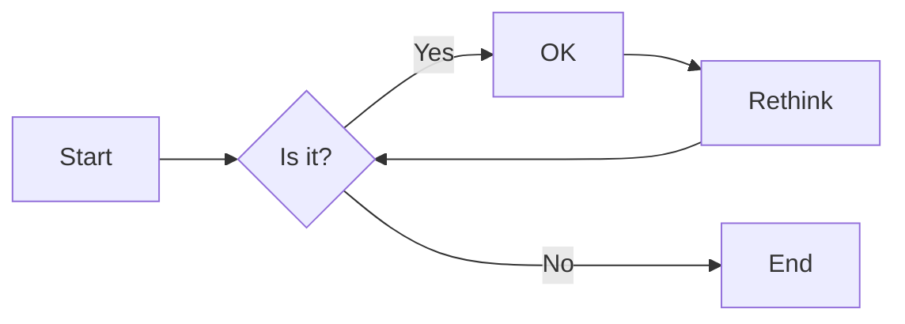

# public-repo-test

## Table of Contents
- [mermaid 甘特圖](#gantt-chart-by-mermaid)
- [mermaid 程序圖](#sequence-diagram-by-mermaid)
- [mermaid 流程圖](#flow-chart-by-mermaid)

## Gantt chart by mermaid

## sequence diagram by mermaid

## flow chart by mermaid

